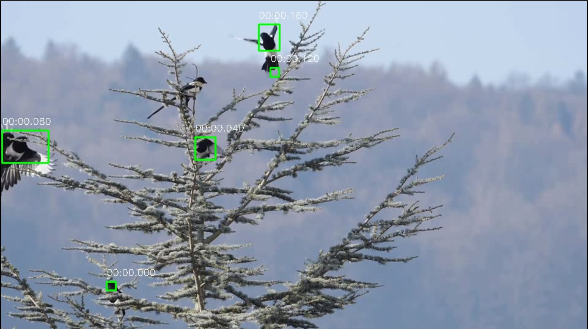
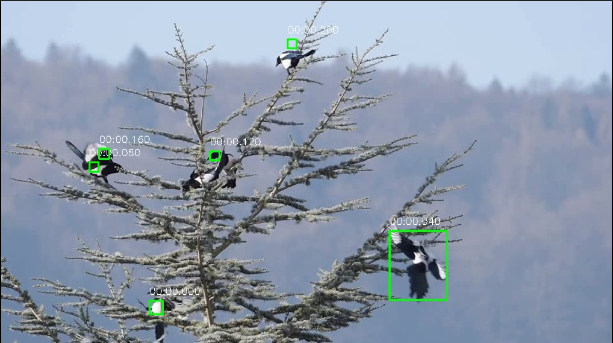

# Video Processing Kit (Moving Background Filter)

A C++ video processing toolkit designed to detect and track moving bodies within a video stream. This project utilizes OpenCV to implement background subtraction, morphological operations, and centroid tracking.

## Features

* **Background Modelling:** Uses accumulated weighted average to separate the foreground (moving bodies) from the static background.
* **Frame Differencing:** Calculates the difference between consecutive frames to detect motion.
* **Morphological Operations:** Applies erosion and dilation to reduce noise and connect blobs in the binary mask.
* **Centroid Tracking:** Identifies and tracks moving bodies across frames, calculating their centroids and drawing bounding boxes with timestamps.
* **Video I/O:** Utilities to load video files, convert them to grayscale, and save the processed output.

## Sample Results

The following images demonstrate the output of the centroid tracker, showing detected birds with bounding boxes and timestamps.





## Dependencies

* **C++17** or higher
* **CMake** (Version 3.10+)
* **OpenCV** (Core, HighGUI, VideoIO, ImgCodecs)

## Build Instructions

1.  **Clone the repository:**
    ```bash
    git clone <repository-url>
    cd <repository-folder>
    ```

2.  **Create a build directory:**
    ```bash
    mkdir build
    cd build
    ```

3.  **Configure with CMake:**
    ```bash
    cmake ..
    ```

4.  **Build the executable:**
    ```bash
    make
    ```

## Usage

After building, you can run the application using:

```bash
./app
